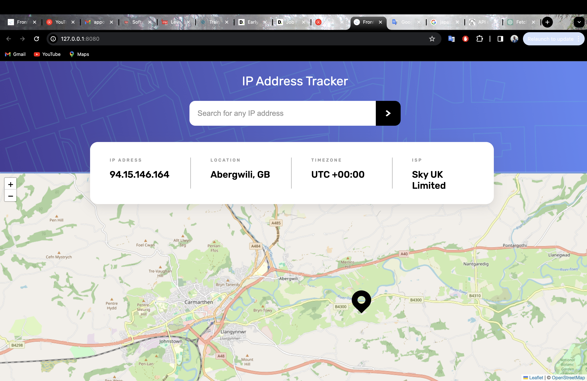
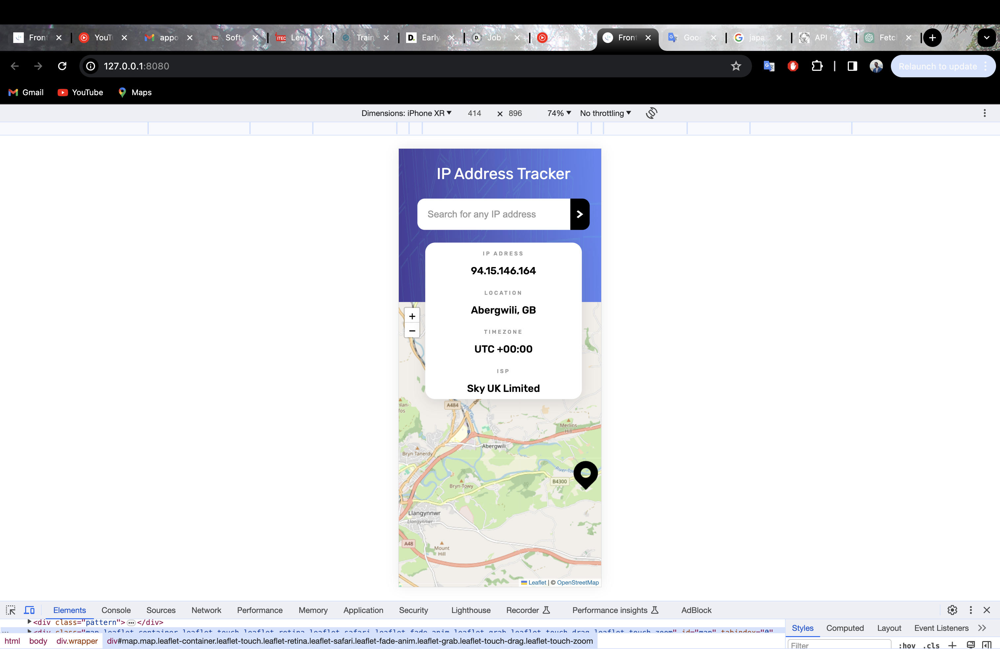

# Frontend Mentor - IP address tracker solution

### The challenge

Users should be able to:

- View the optimal layout for each page depending on their device's screen size
- See hover states for all interactive elements on the page
- See their own IP address on the map on the initial page load
- Search for any IP addresses and see the key information and location

### Screenshot

### Links

- Live Site URL: [Add live site URL here](https://your-live-site-url.com)

## My process

### Built with

- Semantic HTML5 markup
- CSS custom properties
- Flexbox
- Vanilla Javascript

his section and replace with your own learnings.\*\*

## Author

- [LinkedIn](https://www.linkedin.com/in/maksym-kostiuk-261958297/)
